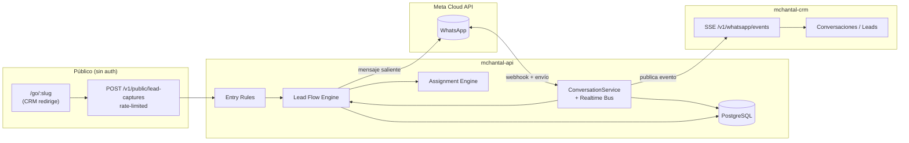

# mchantal-api — Documentación

> **Documento vivo.** Este índice y los docs de cada módulo describen **cómo está el sistema hoy**. Cuando el código cambie, edita el doc correspondiente; no dejes histórico acumulado dentro de los archivos. Las decisiones de fondo se registran como ADRs en `decisions/` (solo se agregan, no se editan).

API backend del CRM de Madame Chantal. Stack: **Fastify 5 + TypeORM + PostgreSQL + TypeScript** (validación con TypeBox). Integración con **WhatsApp Cloud API (Meta)** y módulo de **captura de leads / campañas / flows conversacionales**.

## Mapa de módulos

| Módulo | Doc | Resumen |
|-------|-----|---------|
| Auth | [modules/auth.md](modules/auth.md) | Registro, login, JWT (access + refresh), reset de password por email |
| RBAC | [modules/rbac.md](modules/rbac.md) | Permisos custom en código, roles, asignación a usuarios, hook `requirePermission` |
| WhatsApp | [modules/whatsapp.md](modules/whatsapp.md) | Webhook Meta, conversaciones, mensajes, tiempo real vía SSE (+ Redis pub/sub) |
| Leads & Campañas | [modules/leads-campaigns.md](modules/leads-campaigns.md) | Captura pública, campañas, entry rules, flows conversacionales, asignación de ejecutivos |
| Analytics | [modules/analytics.md](modules/analytics.md) | Rollups diarios (global y por campaña), KPIs y charts |

## Decisiones de arquitectura (ADRs)

| ADR | Título | Estado |
|-----|--------|--------|
| [ADR-001](decisions/ADR-001-rbac-custom-en-lugar-de-libreria.md) | RBAC custom en lugar de librería | Aceptado |
| [ADR-002](decisions/ADR-002-sse-en-lugar-de-websockets.md) | SSE en lugar de WebSockets para tiempo real | Aceptado |
| [ADR-003](decisions/ADR-003-whatsapp-provider-abstraido.md) | `WhatsAppProvider` abstraído (Meta implementado, Dialog360 reservado) | Aceptado |
| [ADR-004](decisions/ADR-004-rate-limit-en-captura-publica.md) | Rate limit en la captura pública de leads | Aceptado |

## Diagrama de alto nivel

Flujo principal: **captura pública → entry rules → enrollment como `CampaignLead` + `LeadFlowState` → flow conversacional por WhatsApp → asignación de ejecutivo → bandeja de leads/conversaciones en el CRM**. Los mensajes entrantes de WhatsApp disparan el flow; los salientes los emite el flow o el agente humano desde el CRM.

## Glosario

- **Folio** — identificador corto (string, único) generado en la captura pública. El contacto lo envía por WhatsApp para que el sistema enlace el mensaje con la campaña/lead (`FOLIO_REGEX` en `folio.service.ts`).
- **Campaña** (`Campaign`) — configuración de captura con `slug`, `param_definitions`, `entry_rules`, `flow_definition` y `status_definitions`. Estados: `draft | active | paused | archived`.
- **Captura / Lead Capture** (`LeadCapture`) — registro de un envío del formulario público. Resuelve entry rules → mensaje, intent, entry node, contexto inicial. Estados: `pending | matched | expired`.
- **Campaign Lead** (`CampaignLead`) — el lead "vivo" por contacto+campaigna, con `statusKey`, `resolvedIntent`, `context`, `assigneeUserId`, `isSuccessful`.
- **Entry Rules** — reglas que, según los params capturados, producen efectos (`set_message_template`, `set_intent`, `set_initial_status`, `set_entry_node`, `set_context`, `append_message`, `set_tags`).
- **Flow Definition** — grafo de nodos (`text_message`, `interactive_buttons`, `set_context`, `set_intent`, `set_status`, `assign_executive`, `handoff`) que guía la conversación automatizada.
- **Lead Flow State** (`LeadFlowState`) — estado de ejecución del flow para un lead: `currentNodeId`, `context`, `status` (`active | completed | handed_off | abandoned`).
- **Executive Pool** — pool de ejecutivos por rol (`{ kind: 'role', roleSlug, segments? }`) usado en asignación `round_robin` o `least_load`.
- **Assignment Rule Set** (`AssignmentRuleSet`) — conjunto versionado de reglas de asignación por campaña (`rules` en JSONB, `version`, `effectiveFrom`, `isActive`).
- **User Lead Profile** (`UserLeadProfile`) — por usuario: `segments`, `isAcceptingLeads`, `maxActiveLeads`.
- **Origen** — param de tracking (default `origin`); si falta se normaliza a `unknown`. Se usa para segmentación de analytics y asignación.
- **Realtime Bus** — bus de eventos WhatsApp (`message.created`, `message.status_updated`, `conversation.updated`, `conversation.read`). Implementación in-memory por defecto; Redis pub/sub si `REDIS_URL` está seteado (para múltiples réplicas del API).
- **Permisos** — catálogo en código (`permissions.catalog.ts`). Ver [modules/rbac.md](modules/rbac.md).

## Convenciones de mantenimiento

1. **Editar, no acumular.** Cuando cambies código de un módulo, actualiza `modules/<modulo>.md` en el mismo commit. Borra lo obsoleto.
2. **ADRs solo se agregan.** Si una decisión cambia, crea un nuevo ADR y marca el anterior como `Superseded by ADR-NNN`.
3. **Un ADR por decisión no obvia** (stack, patrón, trade-off). No documentes lo evidente.
4. **Enlaza front ↔ back.** Los docs del CRM referencian a los del API con rutas relativas (`../../mchantal-api/docs/...`) y viceversa cuando aplica.