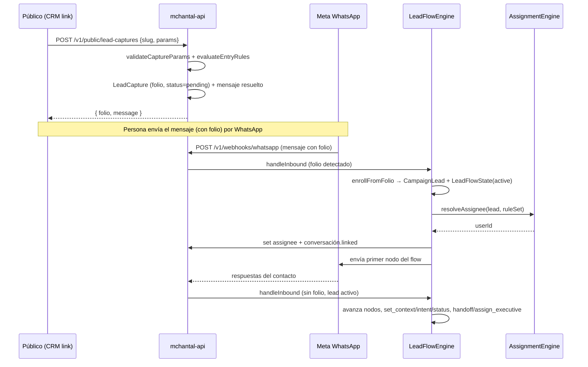

# Leads & Campañas

> Estado: documento vivo. Editar cuando el código cambie. Es el módulo más grande y el de desarrollo más activo.

## Propósito

Capturar prospectos desde campañas públicas (links `/go/:slug`), enrutarlos a un **flow conversacional** por WhatsApp, **asignarlos** a ejecutivos y exponerlos en la bandeja del CRM.

## Alcance

- Captura pública anónima (rate-limited).
- Configuración de campañas (params, entry rules, flow, status definitions, ejecutivos).
- Enrollment de leads y ejecución del flow conversacional.
- Motor de asignación (reglas, pools, round-robin / least-load).
- Reasignación manual.
- Perfil de ejecutivo (`UserLeadProfile`).
- Reglas de asignación versionadas (`AssignmentRuleSet`).

**No** cubre analytics por separado (ver [analytics.md](analytics.md)) ni RBAC (ver [rbac.md](rbac.md)).

## Cómo funciona (flujo)

### 1. Captura pública
`POST /v1/public/lead-captures` (sin auth, rate-limited por `PUBLIC_CAPTURE_RATE_LIMIT` — ver [ADR-004](../decisions/ADR-004-rate-limit-en-captura-publica.md)). El CRM genera el link `/go/:campaignSlug?origin=...&...` y al cargar la página llama a este endpoint.

1. `validateCaptureParams` (normaliza `origin` a `unknown` si falta; valida `allowedValues`).
2. `evaluateEntryRules` aplica la primera regla que matchee (o `_default`) → `EntryRulesResult`: `messageTemplate` (con `{{folio}}`), `resolvedIntent`, `entryNodeId`, `initialContext`, `initialStatusKey`, `tags`.
3. Genera `folio` único (`folio.service.ts`).
4. Persiste `LeadCapture` (`status=pending`).
5. Devuelve `{ folio, message }` para que la persona lo copie.

### 2. Entry Rules
Definidas por campaña (`Campaign.entryRules` JSONB). Cada regla: `when` (`Record<param,value>` o `{_default:true}`) → `effects[]` (`set_message_template`, `set_intent`, `set_initial_status`, `set_entry_node`, `set_context`, `append_message`, `set_tags`). Tipos en `modules/leads/types/campaign-config.types.ts`.

### 3. Enrollment (cuando llega el mensaje con folio)
`LeadFlowEngine.handleInbound` extrae el folio del texto (`FOLIO_REGEX`), busca la `LeadCapture` pendiente y, si existe, crea `CampaignLead` + `LeadFlowState` (`currentNodeId = entryNodeId`, `context = initialContext`, `status=active`), enlaza la conversación (`lead_id`, `assignee`), marca la captura `matched`, y dispara el primer nodo.

Si no hay folio pero la conversación no tiene lead, busca un `CampaignLead` activo por `contactId` y lo enlaza.

### 4. Flow conversacional
Grafo en `Campaign.flowDefinition` (`{ nodes: Record<id, FlowNode> }`). Nodos (`modules/leads/types/flow-definition.types.ts`):

| Nodo | Acción |
|------|--------|
| `text_message` | envía texto, opcional `nextNodeId` |
| `interactive_buttons` | envía botones; `transitions` por `button.id`; `onFreeText` (`reprompt`/`fallback_node`/`handoff`) |
| `set_context` | mergea `values` al contexto del flow |
| `set_intent` | setea `resolvedIntent` del lead |
| `set_status` | setea `statusKey` |
| `assign_executive` | dispara `AssignmentEngine` con `ruleSetKey`; `messageAfterAssign?` |
| `handoff` | pasa al agente humano (termina automatismo) |

Estado guardado en `LeadFlowState` (`currentNodeId`, `context`, `status` `active|completed|handed_off|abandoned`, `lastInteractionAt`).

### 5. Asignación
`AssignmentEngine.resolveAssignee(lead, ruleSet)`:
- Recorre `AssignmentRule[]` por `priority`, evalúa `when` (`intent`, `origin`, `tags`, `answers`, `_default`).
- `assign` puede ser `{ type: 'user', userId }`, `{ type: 'round_robin', pool }` o `{ type: 'least_load', pool }`.
- `ExecutivePool = { kind: 'role', roleSlug, segments? }`. Round-robin con estado en memoria por pool; least-load por carga activa (`UserLeadProfile` + `isAcceptingLeads` + `maxActiveLeads`).
- Las reglas viven en `AssignmentRuleSet` (versionado: `version`, `effectiveFrom`, `isActive`; `rules` JSONB). Se publican vía `POST /campaigns/:id/assignment-rules`.

### 6. Bandeja y reasignación
- `GET /campaign-leads` lista leads (con filtro por asignado si el caller tiene `leads.inbox.assigned`).
- `PATCH /campaign-leads/:id/assignee` reasigna (requiere `leads.reassign` o `campaigns.manage`).
- `GET /executives/available` lista ejecutivos habilitados por campaña.

## Endpoints

### Público (sin auth, rate-limited)

Prefijo `/v1/public`.

| Método | Ruta | Propósito |
|--------|------|-----------|
| `POST` | `/lead-captures` | Captura inicial; devuelve folio + mensaje |

### Autenticados (JWT + permisos)

Prefijo `/v1`.

| Método | Ruta | Permiso | Propósito |
|--------|------|---------|-----------|
| `GET` | `/campaigns` | `campaigns.manage` **o** `leads.read` | Lista campañas |
| `GET` | `/campaigns/:id` | `campaigns.manage` **o** `leads.read` | Detalle |
| `POST` | `/campaigns` | `campaigns.manage` | Crea campaña |
| `PATCH` | `/campaigns/:id` | `campaigns.manage` | Edita (params, entry rules, flow, status defs) |
| `GET` | `/lead-captures` | `leads.read` | Lista capturas (filtros) |
| `GET` | `/campaign-leads` | `leads.read` **o** `leads.inbox.assigned` | Lista leads |
| `GET` | `/campaign-leads/:id` | `leads.read` **o** `leads.inbox.assigned` | Detalle lead |
| `PATCH` | `/campaign-leads/:id/assignee` | `leads.reassign` **o** `campaigns.manage` | Reasigna |
| `GET` | `/executives/available` | `campaigns.manage` **o** `leads.reassign` | Ejecutivos disponibles |
| `GET` | `/campaigns/:id/assignment-rules` | `campaigns.manage` | Lee rule set |
| `POST` | `/campaigns/:id/assignment-rules` | `campaigns.manage` | Publica nueva versión |

## Modelo de datos

- `campaigns` — `slug unique`, `name`, `status` (`draft|active|paused|archived`), `param_definitions` jsonb, `entry_rules` jsonb, `flow_definition` jsonb, `status_definitions` jsonb.
- `lead_captures` — `folio unique` (12), `campaign_id`, `captured_params` jsonb, `resolved_intent?`, `resolved_message`, `entry_node_id?`, `initial_context` jsonb, `status` (`pending|matched|expired`), `campaign_lead_id?`.
- `campaign_leads` — `contact_id`, `campaign_id`, `lead_capture_id?`, `status_key` (default `nuevo`), `resolved_intent?`, `context` jsonb, `assignee_user_id?`, `is_successful`, `success_at?`, `assigned_at?`, `enrolled_at`, `closed_at?`.
- `lead_flow_states` — `campaign_lead_id unique`, `current_node_id`, `context` jsonb, `status` (`active|completed|handed_off|abandoned`), `last_interaction_at`, `completed_at?`.
- `campaign_executives` — PK `(campaign_id, user_id)`, `enabled`, `priority`.
- `assignment_rule_sets` — `campaign_id`, `key`, `version`, `effective_from`, `is_active`, `rules` jsonb.
- `user_lead_profiles` — `user_id` PK, `segments` jsonb, `is_accepting_leads`, `max_active_leads?`.

Relaciones: `CampaignLead ↔ LeadFlowState` (1:1). `CampaignLead.contact_id → whatsapp_contacts`. La conversación WhatsApp (`whatsapp_conversations.lead_id`) enlaza al lead.

## Componentes

- `modules/leads/services/lead-capture.service.ts` — captura pública, entry rules, folio.
- `modules/leads/services/entry-rules.evaluator.ts` — `validateCaptureParams`, `evaluateEntryRules`, `interpolateTemplate`.
- `modules/leads/services/folio.service.ts` — generación de folio + `FOLIO_REGEX`.
- `modules/leads/services/campaign.service.ts` — CRUD de campañas.
- `modules/leads/services/lead-flow.engine.ts` — **LeadFlowEngine** (core del flow).
- `modules/leads/services/assignment.engine.ts` — **AssignmentEngine**.
- `modules/leads/services/campaign-lead.service.ts`, `user-lead-profile.service.ts`.
- `modules/leads/repositories/*` — campaign, campaign-lead, lead-capture, lead-flow-state, campaign-executive, assignment-rule-set, user-lead-profile.
- `modules/leads/controllers/leads.controller.ts` + `routes/leads.routes.ts`.
- `modules/leads/middleware/rate-limit.hook.ts` — rate limit de captura pública.
- `modules/leads/create-lead-flow-engine.ts` — fábrica del engine.
- `modules/leads/schemas/leads.schemas.ts` — TypeBox (incluye defaults de flow/status/rules en el CRM).
- `modules/leads/types/{flow-definition,campaign-config}.types.ts`.

## Migraciones relevantes

`1748300000000-LeadsInitial`, `1748400000000-LeadsFlowInitial`, `1748600000000-LeadsExecutiveP4`.

## Decisiones relevantes

- Rate limit en captura pública — [ADR-004](../decisions/ADR-004-rate-limit-en-captura-publica.md).

## Pendientes / Notas

- Round-robin mantiene estado **en memoria** (`roundRobinState` Map). No sobrevive reinicios y no es coherente entre réplicas del API. Pendiente persistir.
- `lead_captures.status=expired` existe pero el job de expiración no está implementado.
- `is_successful`/`success_at` se setean por nodos `set_status` con `isSuccess` (en `status_definitions`), pero el cierre/`closed_at` no está totalmente conectado.
- Los defaults de flow/status/rules para el CRM viven en `mchantal-crm/src/lib/api/leads.ts` (`DEFAULT_FLOW_DEFINITION`, `DEFAULT_STATUS_DEFINITIONS`, `DEFAULT_ASSIGNMENT_RULES`). Mantener sincronizados con los tipos del backend.